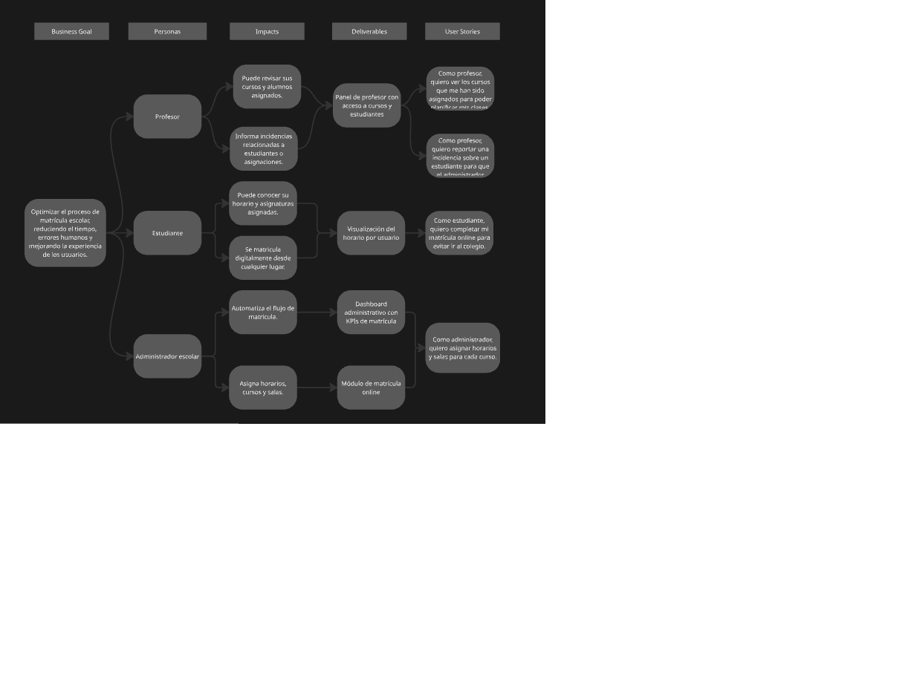

# Capítulo III: Requirements Specification
## 3.1. To-Be Scenario Mapping.
### 🎓 Alumno – Proceso de Inscripción y Gestión Académica
| **Steps**             | **Doing**                                     | **Thinking**                                       | **Feeling**                  |
|-----------------------|-----------------------------------------------|----------------------------------------------------|------------------------------|
| Ingreso al sistema    | Abre Eduflow e inicia sesión                  | “Quiero revisar mis cursos y horarios.”            | Motivado                     |
| Explora cursos        | Navega por el catálogo de cursos              | “¿Cuál se adapta mejor a mis intereses y horario?” | Curioso                      |
| Se inscribe en curso  | Selecciona un curso y hace clic en "Inscribirse" | “Espero que haya cupo disponible.”              | Ansioso pero emocionado      |
| Revisa confirmación   | Recibe notificación y correo de confirmación  | “Perfecto, ya estoy inscrito.”                     | Aliviado y satisfecho        |
| Ver horario           | Consulta calendario de clases                 | “Quiero organizar mis tiempos.”                    | En control                   |
| Participa en clases   | Asiste a clases según el calendario           | “Este curso me está ayudando bastante.”            | Interesado y comprometido    |
| Consulta historial    | Ve inscripciones pasadas                      | “Quiero ver cómo me ha ido en ciclos anteriores.”  | Reflexivo y organizado       |

### 👨‍🏫 Profesor – Gestión de Cursos y Comunicación
| **Steps**             | **Doing**                                     | **Thinking**                                       | **Feeling**                  |
|-----------------------|-----------------------------------------------|----------------------------------------------------|------------------------------|
| Inicia sesión         | Accede a Eduflow como docente                 | “Veamos qué cursos tengo asignados este ciclo.”    | Curioso pero enfocado        |
| Revisa cursos         | Consulta su panel con los cursos asignados    | “Quiero revisar la cantidad de alumnos.”           | Preparado                    |
| Organiza clases       | Sube materiales y organiza el contenido       | “Necesito que los alumnos tengan todo desde el inicio.” | Responsable              |
| Comunica a estudiantes| Envía mensaje masivo a alumnos inscritos      | “Quiero que estén al tanto del primer día de clases.”| Proactivo                  |
| Toma asistencia       | Marca asistencia desde la plataforma          | “Quiero llevar todo en orden.”                     | Ordenado                     |
| Evalúa progreso       | Revisa participación y rendimiento            | “¿Cómo van avanzando mis alumnos?”                 | Comprometido                 |
| Cierra ciclo          | Sube notas finales y deja feedback            | “Quiero que todos sepan cómo mejorar.”             | Cumplido y reflexivo         |

## 3.2. User Stories.
| **Epic/User Story ID** | **Titulo**                                      | **Descripcion**                                       | **Criterios de aceptación**      | **Relacionado con Epic (ID)**   |
|------------------------|-------------------------------------------------|-------------------------------------------------------|----------------------------------|--------------------------------|
| **EP-001**             | Optimización del proceso de matrícula           | La épica aborda la automatización y simplificación del proceso de matrícula para estudiantes y administradores. | Dado que el usuario está en la pantalla de inicio, cuando selecciona "Iniciar sesión", entonces debe ver la pantalla de ingreso de credenciales.   Dado que el usuario olvidó su contraseña, cuando selecciona "Olvidé mi contraseña", entonces debe recibir instrucciones para recuperarla por correo.    Dado que el usuario tiene una sesión iniciada, cuando elige "Cerrar sesión", entonces su sesión debe ser cerrada correctamente.   Además, el sistema debe redirigir al usuario a la pantalla de inicio después de cerrar sesión. | **EP-001** |
| **US-001**             | Registro Simplificado de Estudiantes           | Como estudiante, quiero registrarme fácilmente en la plataforma para acceder a mis cursos. | Dado que soy un estudiante, cuando ingreso mis datos, entonces mi registro se completa sin errores.   Además, el sistema debe validar la información ingresada antes de permitir el registro.    Dado que soy un estudiante, cuando me registro, entonces recibo un correo electrónico de confirmación.   El correo debe incluir mis detalles de acceso y una guía de inicio rápido. | **EP-001** |
| **US-002**             | Acceso rápido al portal de matrícula            | Como administrador, quiero que los estudiantes puedan acceder rápidamente al portal de matrícula. | Dado que soy un administrador, cuando un estudiante accede, entonces es llevado directamente al portal de matrícula.   Además, el portal debe cargarse en menos de 5 segundos.    Dado que el estudiante ya está registrado, cuando hace clic en "Acceder a matrícula", entonces debe ser redirigido sin pasos adicionales.   El acceso debe ser fluido y sin interrupciones. | **EP-001** |
| **US-003**             | Confirmación automática de matrícula            | Como estudiante, quiero recibir una confirmación automática cuando complete mi matrícula. | Dado que soy un estudiante, cuando finalizo mi matrícula, entonces recibo una confirmación por correo electrónico.   Además, la confirmación debe incluir todos los detalles de la matrícula realizada.    Dado que soy un estudiante, cuando termino el proceso de matrícula, entonces se me debe mostrar una página de agradecimiento.   Esta página debe contener información relevante sobre los próximos pasos. | **EP-001** |
| **EP-002**             | Gestión de cursos y horarios                    | Esta épica busca mejorar la organización y gestión de cursos y horarios tanto para estudiantes como para profesores. | Dado que el usuario está en la pantalla de inicio, cuando selecciona "Ver mis cursos", entonces debe ver una lista de todos sus cursos actuales.   Además, los cursos deben estar organizados por fecha y hora.    Dado que el usuario está en su perfil, cuando selecciona "Ver horarios", entonces debe ver el horario completo de clases.   Además, debe poder ver detalles como el lugar y el profesor de cada clase. | **EP-002** |
| **US-004**             | Visualización de cursos actuales                | Como estudiante, quiero ver todos los cursos en los que estoy matriculado. | Dado que soy un estudiante, cuando accedo a mi perfil, entonces debo ver una lista de mis cursos actuales.   Además, los cursos deben estar clasificados por semestre o período.    Dado que soy un estudiante, cuando selecciono un curso, entonces debo ver la descripción del curso, incluyendo los objetivos, el contenido y las fechas clave.   También deben incluirse los detalles del profesor. | **EP-002** |
| **US-005**             | Gestión de horarios de clases                   | Como profesor, quiero gestionar y visualizar mis horarios de clase en un solo lugar. | Dado que soy un profesor, cuando accedo a mi perfil, entonces debo ver mis horarios de clases organizados.   Además, puedo editar mis horarios si es necesario.    Dado que soy un profesor, cuando accedo a la página de mis clases, entonces debo poder cambiar la hora o fecha de alguna clase.   El sistema debe validar los cambios antes de confirmarlos. | **EP-002** |
| **US-006**             | Notificación de cambios en horarios             | Como estudiante, quiero recibir notificaciones cuando haya cambios en mis horarios. | Dado que soy un estudiante, cuando hay un cambio en el horario de una de mis clases, entonces recibo una notificación.   Además, la notificación debe incluir el nuevo horario y la razón del cambio.    Dado que soy un estudiante, cuando recibo una notificación de cambio de horario, entonces debo poder ver el nuevo horario directamente en la notificación.   La notificación debe ser clara y fácil de leer. | **EP-002** |
| **US-007**             | Solicitud de días libres                        | Como profesor, quiero solicitar días libres desde el portal. | Dado que soy un profesor, cuando quiero solicitar un día libre, entonces puedo enviar una solicitud a través del portal.   Además, debo recibir una confirmación de la solicitud una vez procesada.    Dado que soy un profesor, cuando selecciono los días libres, entonces el sistema debe verificar si hay clases programadas en esos días.   Si hay clases, debo recibir una advertencia para evitar conflictos. | **EP-002** |
| **US-008**             | Verificación de disponibilidad de aulas         | Como administrador, quiero verificar la disponibilidad de las aulas antes de asignar clases. | Dado que soy un administrador, cuando accedo al sistema, entonces puedo ver la disponibilidad de las aulas en tiempo real.   Además, el sistema debe mostrar los detalles de cada aula, como capacidad y equipamiento disponible.    Dado que soy un administrador, cuando selecciono una aula, entonces debo ver las clases programadas en ella.   El sistema debe mostrar si la aula está ocupada o libre en ese momento. | **EP-002** |
| **EP-003**             | Comunicación eficiente entre alumnos y profesores | Esta épica tiene como objetivo mejorar la interacción entre estudiantes y profesores. | Dado que soy un estudiante, cuando accedo al portal, entonces puedo enviar mensajes a mis profesores.   Además, debo recibir confirmación cuando el mensaje haya sido entregado.    Dado que soy un estudiante, cuando envío un mensaje, entonces debe quedar registrado en un historial de conversaciones.   Este historial debe ser accesible para su consulta posterior. | **EP-003** |
| **US-009**             | Enviar mensajes a profesores                    | Como estudiante, quiero enviar mensajes a mis profesores desde la plataforma. | Dado que soy un estudiante, cuando accedo a la opción de mensajes, entonces puedo redactar y enviar mensajes a mis profesores.   Además, el sistema debe garantizar que los mensajes se envíen correctamente.    Dado que soy un estudiante, cuando envío un mensaje a un profesor, entonces debo recibir una notificación cuando el profesor lo lea.   La notificación debe indicar la hora en que se leyó el mensaje. | **EP-003** |
| **US-010**             | Responder mensajes de estudiantes               | Como profesor, quiero responder mensajes de mis estudiantes directamente desde el portal. | Dado que soy un profesor, cuando recibo un mensaje, entonces puedo responderlo directamente desde mi bandeja de entrada.   Además, la respuesta debe ser enviada en tiempo real.    Dado que soy un profesor, cuando respondo un mensaje, entonces debo ver un registro de las respuestas anteriores.   Este registro debe ser fácil de consultar. | **EP-003** |
| **US-011**             | Registro de asistencia                         | Como profesor, quiero registrar la asistencia de los estudiantes a mis clases de manera rápida y sencilla. | Dado que soy un profesor, cuando inicio la clase, entonces debo tener la opción de registrar la asistencia.   Además, el registro debe ser rápido y sin errores.    Dado que soy un profesor, cuando registro la asistencia, entonces se guarda automáticamente en el sistema.   El sistema debe mostrar un mensaje de confirmación una vez que la asistencia ha sido registrada correctamente. | **EP-003** |
| **US-012**             | Notificación de asistencia                      | Como estudiante, quiero recibir una notificación si mi asistencia no ha sido registrada en una clase. | Dado que soy un estudiante, cuando la clase termina y mi asistencia no ha sido registrada, entonces recibo una notificación.   Además, la notificación debe incluir los detalles de la clase y el motivo del error.    Dado que soy un estudiante, cuando recibo la notificación, entonces debo poder informar sobre la falta de registro directamente desde la notificación.   La notificación debe ser fácil de responder. | **EP-003** |
| **US-013**             | Seguimiento de tareas                          | Como estudiante, quiero poder ver el estado de mis tareas y exámenes de manera clara. | Dado que soy un estudiante, cuando accedo al sistema, entonces debo ver una lista de todas mis tareas y exámenes próximos.   Además, el sistema debe mostrar si las tareas están completas, pendientes o entregadas.    Dado que soy un estudiante, cuando accedo a una tarea, entonces puedo ver los detalles completos, como la fecha de entrega y los requisitos.   Los cambios deben ser visibles en tiempo real. | **EP-003** |
| **US-014**             | Evaluación del desempeño del estudiante        | Como profesor, quiero evaluar el desempeño de los estudiantes de manera eficiente y organizada. | Dado que soy un profesor, cuando accedo a la página de evaluaciones, entonces puedo ver todas las calificaciones de mis estudiantes.   Además, debo poder agregar comentarios y feedback personalizado.    Dado que soy un profesor, cuando completo una evaluación, entonces debo poder enviarla de manera inmediata.   El sistema debe actualizar las calificaciones en tiempo real. | **EP-003** |
| **US-015**             | Subida de materiales educativos                | Como profesor, quiero subir materiales educativos para mis estudiantes de forma fácil. | Dado que soy un profesor, cuando quiero subir un material, entonces debo poder seleccionar el archivo desde mi dispositivo.   Además, el sistema debe aceptar varios tipos de archivo, como PDF y PPT.    Dado que soy un profesor, cuando subo un material, entonces debe ser visible para mis estudiantes de inmediato.   El sistema debe confirmar que el archivo se ha subido correctamente. | **EP-003** |
| **EP-004**             | Gestión de pagos y facturación                  | Esta épica tiene como objetivo gestionar el pago de matrículas y generar facturas para los estudiantes. | Dado que soy un administrador, cuando accedo a la sección de pagos, entonces debo poder ver el historial de pagos de todos los estudiantes.   Además, debo poder generar facturas de manera rápida.    Dado que soy un administrador, cuando se realiza un pago, entonces debe actualizarse automáticamente en el sistema.   El sistema debe generar una factura electrónica que pueda enviarse al estudiante. | **EP-004** |
| **US-016**             | Visualización de historial de pagos             | Como estudiante, quiero ver mi historial de pagos de matrícula para asegurarme de que mis pagos están al día. | Dado que soy un estudiante, cuando accedo a la página de pagos, entonces debo ver mi historial completo de pagos.   Además, los pagos deben estar organizados por fecha y tipo de pago.    Dado que soy un estudiante, cuando selecciono un pago, entonces debo ver los detalles, como la cantidad y la fecha de pago.   El sistema debe permitir la descarga del recibo. | **EP-004** |
| **US-017**             | Generación de factura                          | Como estudiante, quiero generar una factura electrónica de mi matrícula para mis registros. | Dado que soy un estudiante, cuando accedo a mi historial de pagos, entonces debo poder generar una factura en formato PDF.   Además, la factura debe incluir todos los detalles de la matrícula y el monto pagado.    Dado que soy un estudiante, cuando selecciono "Generar factura", entonces el sistema debe proporcionarme un enlace para descargarla.   El enlace debe funcionar correctamente en todo momento. | **EP-004** |
| **US-018**             | Pago en línea de matrícula                      | Como estudiante, quiero pagar mi matrícula en línea de forma segura y rápida. | Dado que soy un estudiante, cuando accedo a la opción de pago, entonces puedo elegir entre varios métodos de pago, como tarjeta de crédito o transferencia bancaria.   Además, el proceso de pago debe ser seguro y cifrado.    Dado que soy un estudiante, cuando realizo el pago, entonces debo recibir una confirmación inmediata en la pantalla y por correo electrónico.   El sistema debe registrar mi pago automáticamente. | **EP-004** |
| **US-019**             | Integración de métodos de pago adicionales      | Como administrador, quiero integrar más métodos de pago en el sistema para que los estudiantes puedan elegir el que prefieran. | Dado que soy un administrador, cuando accedo a la configuración de métodos de pago, entonces puedo añadir nuevos métodos de pago.   Además, debo poder configurar y desactivar los métodos según las necesidades del sistema.    Dado que soy un administrador, cuando integro un nuevo método de pago, entonces debe estar disponible inmediatamente para los estudiantes.   El sistema debe probar el método de pago para verificar su funcionalidad. | **EP-004** |
| **EP-005**             | Reportes y análisis de rendimiento              | Esta épica busca ofrecer reportes detallados sobre el rendimiento de estudiantes, profesores y el sistema en general. | Dado que soy un administrador, cuando accedo a la sección de reportes, entonces puedo ver un resumen del rendimiento general del sistema.   Además, los reportes deben ser descargables en formato Excel o PDF.    Dado que soy un administrador, cuando genero un reporte, entonces puedo ver los detalles por estudiante, profesor o materia.   Los reportes deben generarse en tiempo real sin demora. | **EP-005** |
| **US-020**             | Visualización de reportes de rendimiento        | Como profesor, quiero ver un reporte del rendimiento de mis estudiantes en las diferentes materias. | Dado que soy un profesor, cuando accedo a la sección de reportes, entonces puedo ver un análisis detallado del rendimiento de mis estudiantes.   Además, los datos deben estar organizados por materia y fecha.    Dado que soy un profesor, cuando selecciono un reporte, entonces puedo ver las estadísticas de rendimiento de cada estudiante, como las calificaciones y la asistencia.   El reporte debe ser visualmente claro y comprensible. | **EP-005** |
| **US-021**             | Análisis de desempeño académico                 | Como administrador, quiero realizar un análisis del desempeño académico de los estudiantes en la plataforma. | Dado que soy un administrador, cuando accedo a la sección de análisis, entonces puedo ver un gráfico del desempeño académico de los estudiantes.   Además, el análisis debe mostrar la distribución de calificaciones de todos los estudiantes.    Dado que soy un administrador, cuando selecciono un rango de fechas, entonces puedo obtener un reporte personalizado del desempeño.   El análisis debe ser exportable en formato CSV para su revisión externa. | **EP-005** |
| **US-022**             | Notificación de resultados académicos           | Como estudiante, quiero recibir una notificación cuando los resultados de mis exámenes estén disponibles. | Dado que soy un estudiante, cuando los resultados de un examen están disponibles, entonces recibo una notificación instantánea.   Además, la notificación debe incluir los resultados completos del examen.    Dado que soy un estudiante, cuando abro la notificación, entonces puedo ver los resultados detallados, incluyendo las preguntas correctas e incorrectas.   El sistema debe permitirme revisar mis respuestas. | **EP-005** |
| **US-023**             | Consulta de resultados por materias             | Como estudiante, quiero consultar los resultados de mis exámenes por cada materia. | Dado que soy un estudiante, cuando accedo a la sección de resultados, entonces puedo filtrar los resultados por materia.   Además, el sistema debe mostrar las calificaciones más recientes en la parte superior.    Dado que soy un estudiante, cuando selecciono una materia, entonces puedo ver los detalles de cada examen tomado en esa materia.   Los resultados deben incluir la fecha y los comentarios del profesor. | **EP-005** |
| **US-024**             | Consultar estadísticas de exámenes              | Como profesor, quiero consultar estadísticas de mis exámenes para evaluar el rendimiento de la clase. | Dado que soy un profesor, cuando accedo a la sección de estadísticas, entonces puedo ver un gráfico que resuma el desempeño general de mis estudiantes.   Además, debo poder ver los resultados de cada pregunta.    Dado que soy un profesor, cuando selecciono un examen, entonces puedo ver las calificaciones detalladas por estudiante y por pregunta.   Las estadísticas deben actualizarse en tiempo real. | **EP-005** |
| **US-025**             | Generación de reportes académicos               | Como administrador, quiero generar reportes académicos personalizados para cada materia y estudiante. | Dado que soy un administrador, cuando selecciono un reporte, entonces puedo personalizar los criterios del reporte, como fecha y materia.   Además, el reporte debe generar un resumen detallado del rendimiento.    Dado que soy un administrador, cuando genero el reporte, entonces debo poder exportarlo en formato PDF o Excel.   El sistema debe generar el reporte sin errores. | **EP-005** |
| **US-026**             | Personalización de informes de rendimiento      | Como profesor, quiero personalizar los informes de rendimiento para mostrar solo los datos relevantes para mi clase. | Dado que soy un profesor, cuando accedo a la opción de personalizar informes, entonces puedo seleccionar qué métricas mostrar, como asistencia o calificaciones.   Además, el sistema debe permitir la eliminación de métricas no deseadas.    Dado que soy un profesor, cuando genero un informe, entonces el sistema debe mostrar solo los datos relevantes a mi selección.   Los informes deben ser generados en formato claro y conciso. | **EP-005** |
| **US-027**             | Configuración de límites de asistencia          | Como administrador, quiero establecer límites de asistencia para las clases. | Dado que soy un administrador, cuando configuro un curso, entonces puedo establecer un límite de inasistencias para los estudiantes.   Además, el sistema debe notificar a los estudiantes cuando alcancen el límite.    Dado que soy un administrador, cuando un estudiante supera el límite de inasistencias, entonces el sistema debe mostrar una alerta visible en su perfil.   El sistema debe realizar este seguimiento de manera automática. | **EP-006** |
| **US-028**             | Restricciones de acceso a materiales            | Como administrador, quiero poder restringir el acceso a ciertos materiales educativos basados en el nivel académico del estudiante. | Dado que soy un administrador, cuando configuro materiales educativos, entonces puedo asignar restricciones basadas en el nivel académico de los estudiantes.   Además, el sistema debe mostrar un mensaje claro si un estudiante no tiene acceso a un material.    Dado que soy un administrador, cuando un estudiante accede a un material restringido, entonces se le notificará sobre la restricción.   El acceso debe ser controlado automáticamente. | **EP-006** |
| **US-029**             | Visualización de materiales restringidos        | Como estudiante, quiero ver los materiales educativos restringidos para saber cuáles no puedo acceder. | Dado que soy un estudiante, cuando accedo a la sección de materiales, entonces debo ver los materiales restringidos con un mensaje que indique el motivo de la restricción.   Además, el sistema debe permitir que vea el título y la descripción del material restringido.    Dado que soy un estudiante, cuando intento acceder a un material restringido, entonces se me debe mostrar un mensaje claro indicando que no tengo permisos.   El sistema debe evitar el acceso. | **EP-006** |
| **US-030**             | Gestión de permisos de acceso                   | Como administrador, quiero gestionar los permisos de acceso de los estudiantes a materiales y recursos educativos. | Dado que soy un administrador, cuando configuro un curso, entonces puedo asignar diferentes niveles de acceso a los estudiantes para ver materiales educativos.   Además, debo poder agregar o quitar permisos a los estudiantes fácilmente.    Dado que soy un administrador, cuando cambio los permisos de un estudiante, entonces el sistema debe actualizarse en tiempo real.   Los cambios deben ser confirmados por el sistema. | **EP-006** |
| **US-031**             | Recordatorios para entrega de tareas            | Como estudiante, quiero recibir un recordatorio antes de la fecha límite de entrega de una tarea. | Dado que soy un estudiante, cuando la fecha de entrega de una tarea se acerca, entonces debo recibir un recordatorio en el sistema y por correo electrónico.   Además, el recordatorio debe incluir la fecha y hora de la entrega.    Dado que soy un estudiante, cuando el recordatorio llega, entonces debo tener la opción de hacer clic en él para acceder directamente a la tarea.   El recordatorio debe ser claro y oportuno. | **EP-007** |
| **US-032**             | Gestión de fechas límite de entrega de tareas   | Como profesor, quiero configurar fechas límite de entrega para mis tareas y exámenes. | Dado que soy un profesor, cuando creo una tarea, entonces puedo establecer una fecha y hora límite de entrega.   Además, debo recibir un recordatorio cuando un estudiante se acerque al límite de entrega.    Dado que soy un profesor, cuando la fecha límite llega, entonces el sistema debe bloquear la entrega de la tarea.   El sistema debe enviar una notificación al estudiante cuando se bloquee el acceso. | **EP-007** |
| **US-033**             | Revisión de retroalimentación en tareas         | Como estudiante, quiero revisar los comentarios de mis tareas y exámenes después de la evaluación. | Dado que soy un estudiante, cuando un profesor califica mi tarea, entonces debo poder ver los comentarios detallados.   Además, los comentarios deben ser visibles junto con la calificación.    Dado que soy un estudiante, cuando accedo a los comentarios, entonces debo poder responderlos si tengo preguntas.   El sistema debe permitir una comunicación directa con el profesor a través de los comentarios. | **EP-007** |
| **US-034**             | Retroalimentación en tiempo real                | Como profesor, quiero proporcionar retroalimentación en tiempo real durante las evaluaciones. | Dado que soy un profesor, cuando califico una tarea, entonces puedo proporcionar comentarios en tiempo real para cada estudiante.   Además, los comentarios deben ser visibles inmediatamente después de ser enviados.    Dado que soy un profesor, cuando proporciono retroalimentación, entonces el sistema debe notificar a los estudiantes para que la revisen.   La retroalimentación debe ser clara y específica. | **EP-007** |
| **US-035**             | Integración con plataformas externas de evaluación | Como administrador, quiero integrar la plataforma con herramientas externas de evaluación para facilitar las calificaciones. | Dado que soy un administrador, cuando configuro un curso, entonces debo poder integrar la plataforma con herramientas externas de evaluación, como Google Classroom o Moodle.   Además, las calificaciones deben sincronizarse automáticamente entre las plataformas.    Dado que soy un administrador, cuando los estudiantes completan una evaluación en una plataforma externa, entonces las calificaciones deben actualizarse en tiempo real en Eduflow.   El sistema debe asegurar que los datos sean precisos y estén actualizados. | **EP-007** |
| **US-036**             | Registro de actividades extracurriculares       | Como estudiante, quiero poder inscribirme en actividades extracurriculares para complementar mi formación. | Dado que el usuario está en la pantalla de actividades, cuando selecciona una actividad, entonces debe poder inscribirse directamente.    Dado que el usuario ya está inscrito, cuando visualiza sus actividades, entonces debe ver el estado de inscripción y horarios. | **EP-008** |
| **US-037**             | Creación de actividades extracurriculares       | Como profesor, quiero poder crear y publicar actividades extracurriculares para los estudiantes. | Dado que el usuario está en la pantalla de gestión, cuando selecciona “Crear actividad”, entonces debe poder ingresar nombre, fecha y descripción.    Dado que el usuario publica la actividad, cuando se confirma, entonces debe aparecer en el panel de actividades de los estudiantes. | **EP-008** |
| **US-038**             | Notificaciones para actividades extracurriculares | Como estudiante, quiero recibir notificaciones de nuevas actividades extracurriculares disponibles. | Dado que el usuario tiene habilitadas las notificaciones, cuando se publica una nueva actividad, entonces debe recibir una alerta en tiempo real.    Dado que el usuario ve la notificación, cuando hace clic en ella, entonces debe ser redirigido a la descripción completa de la actividad. | **EP-008** |
| **US-039**             | Visualización del calendario académico          | Como estudiante, quiero ver un calendario con fechas importantes del año escolar para planificarme mejor. | Dado que el usuario está en la pantalla de inicio, cuando accede al calendario, entonces debe visualizar fechas de inicio de clases, exámenes y entregas.    Dado que el usuario desea filtrar el calendario, cuando selecciona una categoría, entonces debe ver solo los eventos de esa categoría. | **EP-009** |
| **US-040**             | Gestión de eventos académicos                   | Como administrador, quiero gestionar eventos en el calendario escolar para mantener informados a todos los usuarios. | Dado que el usuario está en el panel de administración, cuando selecciona “Agregar evento”, entonces debe poder ingresar título, fecha y detalles del evento.    Dado que el evento ha sido creado, cuando los usuarios acceden al calendario, entonces deben poder ver el nuevo evento junto con los demás ya existentes. | **EP-009** |
| **US-041**             | Menú de navegación                   | Como usuario, quiero tener en la Landing Page, un menú de navegación para poder navegar por cada sección de la página. | Dado que el usuario está en la Landing Page, cuando quiere información de la aplicación, entonces la landing page deberá tener un menú de navegación de las secciones. | **EP-010** |
| **US-042**             | Call To Action                   | Como usuario, quiero que la Landing Page, tenga botonces y enlaces internos que me lleven a ciertas secciones. | Dado que el usuario quiere ver las redes sociales de la startup, cuando esta en la landing page, entonces al hacer click en los íconos de redes sociales, se le llevará a su respectiva red social. | **EP-010** |
| **US-043**             | Características                   | Como usuario, quiero que la Landing Page, tenga las características de la aplicación web. | Dado que el usuario quiere ver características de la aplicación, cuando esta en la landing page, entonces una sección se encargará de mostrar las funciones del aplicativo. | **EP-010** |
| **TS-001**                 | Creación de Usuario                            | Como Developer, quiero implementar un endpoint POST para la creación de usuarios para que los nuevos usuarios puedan registrarse en Eduflow. | Dado que el cliente envía una solicitud POST a /api/v1/users, Cuando el payload contiene campos válidos (nombre, correo, contraseña), Entonces se debe crear el usuario y retornar un status 201 con los datos del usuario creado.    Dado que el payload contiene campos inválidos, Cuando se envía la solicitud POST, Entonces debe retornar un error 400 con los detalles de los errores de validación. | **EP-001 (Registro de Usuarios)** |
| **TS-002**                 | Autenticación de Usuario                       | Como Developer, quiero implementar un endpoint POST para login para que los usuarios puedan iniciar sesión de manera segura. | Dado que el usuario envía credenciales válidas a /api/v1/auth/login, Cuando estas son correctas, Entonces debe recibir un token de autenticación y status 200.    Dado que las credenciales son incorrectas, Cuando el usuario intenta iniciar sesión, Entonces debe recibir status 401 y un mensaje de error. | **EP-001 (Registro de Usuarios)* |
| **TS-003**                  | Recuperación de Contraseña                     | Como Developer, quiero implementar un flujo de recuperación de contraseña para que los usuarios puedan restablecer su acceso en caso de olvido. | Dado que el usuario solicita restablecimiento en /api/v1/auth/forgot-password, Cuando el correo es válido, Entonces debe recibir instrucciones por correo electrónico.    Dado que el correo no existe, Cuando se envía la solicitud, Entonces debe recibir un error 404 con mensaje de usuario no encontrado. | **EP-001 (Registro de Usuarios)** |
| **TS-004**                  | Visualización de Cursos Disponibles           | Como Developer, quiero crear un endpoint GET para listar los cursos disponibles para que los alumnos puedan ver sus opciones de matrícula. | Dado que el alumno accede a /api/v1/cursos, Cuando hay cursos disponibles, Entonces debe recibir una lista con sus detalles (nombre, horario, cupo).    Dado que no hay cursos, Cuando se hace la solicitud, Entonces debe recibir una lista vacía o un mensaje indicando “No hay cursos disponibles”. | **EP-002 (Proceso de Matrícula)** |
| **TS-005**                  | Inscripción en Curso                           | Como Developer, quiero implementar un endpoint POST para que los alumnos puedan inscribirse en un curso desde la plataforma. | Dado que el alumno envía solicitud POST a /api/v1/inscripciones, Cuando los datos son válidos y hay cupo, Entonces debe registrarse la inscripción y retornar status 201.    Dado que no hay cupo disponible, Cuando se hace la solicitud, Entonces debe retornar un error 409 con mensaje de conflicto. | **EP-002 (Proceso de Matrícula)** |

## 3.3. Impact Mapping.

## 3.4. Product Backlog.

| **#orden**  |**User Story Id**          | **Titulo**                                                            | **Descripcion**                                                                                                                                                                    | **Story Points**               |
|-------------|---------------------------|-------------------------------------------------------------------------|-------------------------------------------------------------------------------------------------------------------------------------------------------------------------------------------------------------------------------------------------------------------------------------------------|--------------------------------|
| 1           | US-001                    | Registro Simplificado de Estudiantes                                    | Como estudiante, quiero registrarme fácilmente en la plataforma para acceder a mis cursos.                                                                                                                                            | 3                              |
| 2           | US-002                    | Acceso rápido al portal de matrícula                                      | Como administrador, quiero que los estudiantes puedan acceder rápidamente al portal de matrícula.                                                                                                                                        | 3                              |
| 3           | US-003                    | Confirmación automática de matrícula                                    | Como estudiante, quiero recibir una confirmación automática cuando complete mi matrícula.                                                                                                                                        | 2                              |
| 4           | US-004                    | Visualización de cursos actuales                                        | Como estudiante, quiero ver todos los cursos en los que estoy matriculado.                                                                                                                                          | 5                              |
| 5           | US-005                    | Gestión de horarios de clases                                            | Como profesor, quiero gestionar y visualizar mis horarios de clase en un solo lugar.                                                                                                                                  | 5                              |
| 6           | US-006                    | Notificación de cambios en horarios                                      | Como estudiante, quiero recibir notificaciones cuando haya cambios en mis horarios.                                                                                                                                | 3                              |
| 7           | US-007                    | Solicitud de días libres                                                | Como profesor, quiero solicitar días libres desde el portal.                                                                                                                                  | 2                              |
| 8           | US-008                    | Verificación de disponibilidad de aulas                                | Como administrador, quiero verificar la disponibilidad de las aulas antes de asignar clases.                                                                                                            | 3                              |
| 9           | US-009                    | Enviar mensajes a profesores                                            | Como estudiante, quiero enviar mensajes a mis profesores desde la plataforma.                                                                                                                      | 5                              |
| 10          | US-010                    | Responder mensajes de estudiantes                                        | Como profesor, quiero responder mensajes de mis estudiantes directamente desde el portal.                                                                                                                    | 3                              |
| 11          | US-011                    | Registro de asistencia                                                | Como profesor, quiero registrar la asistencia de los estudiantes a mis clases de manera rápida y sencilla.                                                                                                                    | 2                              |
| 12          | US-012                    | Notificación de asistencia                                            | Como estudiante, quiero recibir una notificación si mi asistencia no ha sido registrada en una clase.                                                                                                                    | 8                              |
| 13          | US-013                    | Seguimiento de tareas                                                  | Como estudiante, quiero poder ver el estado de mis tareas y exámenes de manera clara.                                                                                                                    | 5                              |
| 14          | US-014                    | Evaluación del desempeño del estudiante                                | Como profesor, quiero evaluar el desempeño de los estudiantes de manera eficiente y organizada.                                                                                                                | 8                              |
| 15          | US-015                    | Subida de materiales educativos                                        | Como profesor, quiero subir materiales educativos para mis estudiantes de forma fácil.                                                                                                              | 3                              |
| 16          | US-016                    | Visualización de historial de pagos                                    | Como estudiante, quiero ver mi historial de pagos de matrícula para asegurarme de que mis pagos están al día.                                                                                                            | 3                              |
| 17          | US-017                    | Generación de factura                                                | Como estudiante, quiero generar una factura electrónica de mi matrícula para mis registros.                                                                                                                    | 3                              |
| 18          | US-018                    | Pago en línea de matrícula                                            | Como estudiante, quiero pagar mi matrícula en línea de forma segura y rápida.                                                                                                                | 4                              |
| 19          | US-019                    | Integración de métodos de pago adicionales                            | Como administrador, quiero integrar más métodos de pago en el sistema para que los estudiantes puedan elegir el que prefieran.                                                                                              | 5                              |
| 20          | US-020                    | Visualización de reportes de rendimiento                                | Como profesor, quiero ver un reporte del rendimiento de mis estudiantes en las diferentes materias.                                                                                                            | 4                              |
| 21          | US-021                    | Análisis de desempeño académico                                         | Como administrador, quiero realizar un análisis del desempeño académico de los estudiantes en la plataforma.                                                                                                          | 3                              |
| 22          | US-022                    | Notificación de resultados académicos                                  | Como estudiante, quiero recibir una notificación cuando los resultados de mis exámenes estén disponibles.                                                                                                              | 4                              |
| 23          | US-023                    | Consulta de resultados por materias                                    | Como estudiante, quiero consultar los resultados de mis exámenes por cada materia.                                                                                                            | 5                              |
| 24          | US-024                    | Consultar estadísticas de exámenes                                    | Como profesor, quiero consultar estadísticas de mis exámenes para evaluar el rendimiento de la clase.                                                                                                    | 4                              |
| 25          | US-025                    | Generación de reportes académicos                                    | Como administrador, quiero generar reportes académicos personalizados para cada materia y estudiante.                                                                                                    | 4                              |
| 26          | US-026                    | Personalización de informes de rendimiento                            | Como profesor, quiero personalizar los informes de rendimiento para mostrar solo los datos relevantes para mi clase.                                                                                  | 3                              |
| 27          | US-027                    | Configuración de límites de asistencia                                | Como administrador, quiero establecer límites de asistencia para las clases.                                                                                                            | 2                              |
| 28          | US-028                    | Restricciones de acceso a materiales                                  | Como administrador, quiero poder restringir el acceso a ciertos materiales educativos basados en el nivel académico del estudiante.                                                                                    | 3                              |
| 29          | US-029                    | Visualización de materiales restringidos                                | Como estudiante, quiero ver los materiales educativos restringidos para saber cuáles no puedo acceder.                                                                                                  | 5                              |
| 30          | US-030                    | Gestión de permisos de acceso                                          | Como administrador, quiero gestionar los permisos de acceso de los estudiantes a materiales y recursos educativos.                                                                                      | 3                              |
| 31          | US-031                    | Recordatorios para entrega de tareas                                | Como estudiante, quiero recibir un recordatorio antes de la fecha límite de entrega de una tarea.                                                                                                        | 5                              |
| 32          | US-032                    | Gestión de fechas límite de entrega de tareas                        | Como profesor, quiero configurar fechas límite de entrega para mis tareas y exámenes.                                                                                                | 4                              |
| 33          | US-033                    | Revisión de retroalimentación en tareas                                | Como estudiante, quiero revisar los comentarios de mis tareas y exámenes después de la evaluación.                                                                                                    | 3                              |
| 34          | US-034                    | Retroalimentación en tiempo real                                    | Como profesor, quiero proporcionar retroalimentación en tiempo real durante las evaluaciones.                                                                                                      | 3                              |
| 35          | US-035                    | Integración con plataformas externas de evaluación                    | Como administrador, quiero integrar la plataforma con herramientas externas de evaluación para facilitar las calificaciones.                                                                                    | 4                              |
| 36          | US-041                    | Menú de navegación                                                | Como usuario, quiero tener en la Landing Page, un menú de navegación para poder navegar por cada sección de la página.                                                                                        | 4                              |
| 37          | US-042                    | Call To Action                                                  | Como usuario, quiero que la Landing Page, tenga botonces y enlaces internos que me lleven a ciertas secciones.                                                                                        | 4                              |
| 38          | US-043                    | Características                                                | Como usuario, quiero que la Landing Page, tenga las características de la aplicación web.                                                                                        | 3                             |

